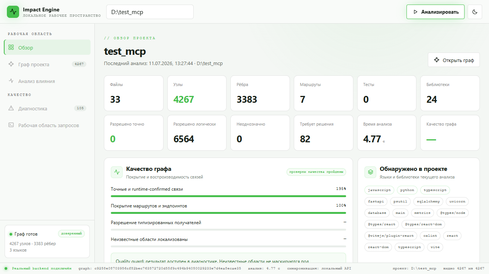
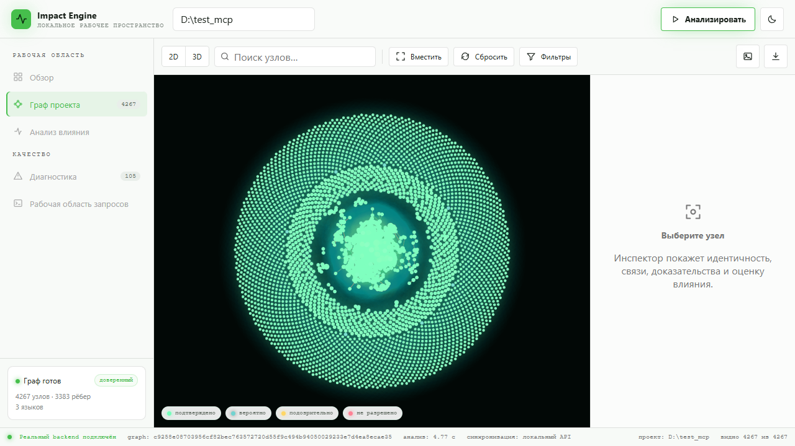

# CodeSlicer

**CodeSlicer** — локальная система анализа влияния изменений в коде.
Она строит граф проекта, сохраняет доказательства связей и показывает, что
нужно проверить после изменения файла, функции, сервиса или endpoint-а.

Внутреннее имя Python-пакета и команд — `impact_engine`.

> Изменили `OrderRepository.save`? CodeSlicer помогает понять, какие сервисы,
> маршруты, frontend-компоненты и тесты могут быть затронуты.

## Содержание

- [Возможности](#возможности)
- [Быстрый старт](#быстрый-старт)
- [Анализ проекта](#анализ-проекта)
- [Визуальный интерфейс](#визуальный-интерфейс)
- [MCP](#mcp)
- [Неизвестные библиотеки](#неизвестные-библиотеки)
- [PR-review](#pr-review)
- [Формат графа](#формат-графа)
- [Поддержка языков](#поддержка-языков)
- [Структура репозитория](#структура-репозитория)
- [Ограничения](#ограничения)
- [Разработка](#разработка)

## Как это работает

```text
проект
  -> inventory и scan-plan
  -> извлечение исходных фактов
  -> нормализация
  -> semantic binding
  -> resolvers и support packs
  -> quality guard
  -> GraphDocument
  -> impact query / PR-review / визуализация
```

Экстракторы извлекают факты из исходного кода. Резолверы создают семантические
рёбра только при наличии цепочки доказательств. Неоднозначные и неподдержанные
случаи остаются в диагностике, а не превращаются в подтверждённые связи по
одному совпадению имени.

## Возможности

- инвентаризация проекта и детерминированный план области анализа;
- Python AST-анализ с наиболее полным semantic resolution;
- structural и limited semantic extraction для JavaScript, TypeScript, Go и
  Java через Tree-sitter;
- разрешение импортов, constructor/field/provider binding и nested object chains;
- frontend → backend endpoint bridge по service, HTTP method и canonical path;
- versioned support packs с provenance, trust level и confidence caps;
- impact queries, объяснение рёбер и PR-review;
- выбор связанных тестов;
- дополнительная runtime-проверка Python-связей;
- локальный SQLite registry и JSON cache;
- CLI, MCP-сервер и локальный 2D/3D graph viewer.

## Быстрый старт

### Требования

- Python 3.10 или новее;
- Git;
- права записи в рабочую директорию;
- Node.js опционален и нужен только для browser verification или инструментов
  самого анализируемого frontend-проекта;
- Docker опционален.

### Windows PowerShell

```powershell
git clone https://github.com/artemnoor/CodeSlicer.git
cd CodeSlicer
py -3 -m venv .venv
.venv\Scripts\Activate.ps1
python -m pip install --upgrade pip
pip install -e .
```

### Linux или macOS

```bash
git clone https://github.com/artemnoor/CodeSlicer.git
cd CodeSlicer
python3 -m venv .venv
source .venv/bin/activate
python -m pip install --upgrade pip
pip install -e .
```

Проверьте установку:

```bash
impact-engine doctor
impact-engine --json registry status
```

Registry должен работать в режиме `sqlite`.

## Анализ проекта

### 1. Сначала проверьте область

Для большого проекта сначала создайте scan plan:

```bash
impact-engine scan-plan /path/to/project
```

План исключает `node_modules`, виртуальные окружения, `.git`, `.impact_engine`,
build/dist/coverage и вложенные Git-репозитории. Перед анализом большого
workspace просмотрите список включённых файлов.

### 2. Постройте граф

```bash
impact-engine analyze /path/to/project \
  --use-scan-plan \
  --out /path/to/project/.impact_engine/graph.json
```

Граф лучше сохранять именно в `.impact_engine/graph.json`: его автоматически
подхватит локальный визуальный интерфейс. Во время обычного запуска CLI
показывает прогресс по этапам. При `--json` структурированный результат
остаётся в stdout, а прогресс выводится в stderr.

### 3. Выполните запрос влияния

```bash
impact-engine impact /path/to/project/.impact_engine/graph.json \
  --symbol repositories.OrderRepository.save \
  --direction both
```

Доступны направления `upstream`, `downstream` и `both`. Для автоматической
обработки агентом добавляйте `--json` перед подкомандой.

### 4. Объясните связь

```bash
impact-engine explain-edge /path/to/project/.impact_engine/graph.json \
  --from services.OrderService.create_order \
  --to repositories.OrderRepository.save
```

Ответ содержит источник, confidence, evidence chain, resolver attribution и
support-pack rule, если они участвовали в создании связи.

## Визуальный интерфейс

Запустите локальный API:

```bash
impact-engine-local-api \
  --host 127.0.0.1 \
  --port 8001 \
  --default-project /path/to/project
```

Откройте <http://127.0.0.1:8001/>.

CLI и API — отдельные процессы. API автоматически загружает
`<project>/.impact_engine/graph.json`. Если граф пустой, проверьте:

```text
GET /api/health  -> status: ok
GET /api/state   -> has_analysis: true
GET /api/graph   -> непустые nodes и edges
```

Для графа в другом месте используйте `POST /api/load-graph`:

```json
{
  "project_path": "/path/to/project",
  "graph_path": "/path/to/graph.json"
}
```

Интерфейс работает с реальным локальным GraphDocument. Mock-графа, Supabase и
другой hosted database в UI нет.

### Пример интерфейса

Обзор проекта показывает количество файлов, узлов, рёбер, маршрутов,
библиотек, качество графа и обнаруженные технологии:



Сам граф отображается в 2D и 3D режимах. Узлы можно искать, фильтровать,
выбирать и исследовать через панель доказательств:



## MCP

CodeSlicer предоставляет локальный JSON-RPC MCP-сервер через stdio:

```bash
impact-engine-mcp
```

или:

```bash
python -m impact_engine.mcp.server
```

Пример конфигурации редактора или AI-агента:

```json
{
  "mcpServers": {
    "codeslicer": {
      "command": "impact-engine-mcp",
      "args": []
    }
  }
}
```

Используйте `tools/list` как источник актуальных MCP-схем. Сервер предоставляет
инструменты для inventory, анализа, impact queries, explain-edge, PR-review,
runtime validation, support packs, research workflow и локального registry.

Подробнее: [docs/MCP.md](docs/MCP.md).

## Неизвестные библиотеки

Если библиотека не покрыта доверенным support pack, система не угадывает её
семантику по имени. Она создаёт research request:

```text
unknown library
  -> research request
  -> официальные docs и repository
  -> candidate support pack
  -> schema/provenance/fixture/mutation validation
  -> trust promotion
  -> повторный анализ
```

Запуск workflow:

```bash
impact-engine libraries research /path/to/project \
  --library unknown_library \
  --ecosystem python \
  --build-input
```

Внешний AI-агент или человек создаёт candidate pack. Детерминированное ядро
проверяет его и не позволяет AI напрямую записывать подтверждённые рёбра.

Полный регламент: [docs/SUPPORT_PACKS.md](docs/SUPPORT_PACKS.md).

## PR-review

`--diff-file` указывает изменение для проверки, но не ограничивает область
первичного парсинга. Если не передать `--graph`, CodeSlicer может заново
анализировать весь большой проект.

Сначала создайте или обновите граф:

```powershell
impact-engine analyze C:\path\to\project `
  --use-scan-plan `
  --out C:\path\to\project\.impact_engine\graph.json
```

Затем переиспользуйте его:

```powershell
impact-engine pr-review C:\path\to\project `
  --diff-file C:\path\to\change.diff `
  --graph C:\path\to\project\.impact_engine\graph.json
```

Отчёт содержит изменённые файлы и символы, risk score, confirmed/likely/
suspicious impact, unresolved boundaries и рекомендуемые тесты.

## Формат графа

Анализ создаёт JSON-артефакт `GraphDocument`:

- `nodes` — файлы, модули, классы, функции, методы, routes, tests и внешние
  библиотеки;
- `edges` — imports, calls, bindings, route handling, HTTP calls, endpoint
  matches и другие типизированные связи;
- `metadata` — языки, diagnostics, coverage, unknown regions, fingerprints,
  resolver data и support-pack provenance.

Узлы имеют stable canonical identity и source location. Рёбра могут содержать
confidence, evidence, `source_fact_ids`, `dependency_keys`, `resolver_id` и
статус разрешения.

## Поддержка языков

| Язык | Статус |
| --- | --- |
| Python | strongest semantic baseline |
| JavaScript / TypeScript | structural + limited semantic и frontend endpoint bridge |
| Go | structural + limited semantic resolution |
| Java | structural + limited semantic resolution |

Для JavaScript, TypeScript, Go и Java возможен явный `fallback`, если native
Tree-sitter недоступен. Это не означает compiler-level parity с Python.
Некоторые framework-specific связи появляются только после установки
проверенного support pack.

## Структура репозитория

```text
src/impact_engine/        ядро, CLI, MCP и local API
support_packs/             правила фреймворков и библиотек
frontend/                  локальный graph viewer
tests/                     unit, fixture, CLI, MCP и regression tests
examples/                  небольшие воспроизводимые проекты
docs/                      подробная документация
integrations/agent-skills  инструкции для AI-агентов
```

## Ограничения

CodeSlicer — статический анализатор, а не компилятор и не универсальный
runtime debugger. На качество влияют:

- reflection и динамический dispatch;
- runtime-selected dependency injection;
- сложные generics и generated proxies;
- динамическая сборка routes и URL;
- private dependencies без support pack;
- отсутствие достаточных типов и evidence.

Такие случаи классифицируются как `ambiguous`, `unresolved`, `unsupported`
или `suspicious`, а не объявляются подтверждёнными без доказательств.

Текущая scoring-модель — интерпретируемая эвристика, а не научно
калиброванная вероятность. Коэффициенты можно калибровать по размеченным
изменениям, результатам тестов и пользовательской обратной связи.

Подробнее: [docs/LIMITATIONS.md](docs/LIMITATIONS.md).

## Разработка

```bash
python -m pytest -q
impact-engine doctor
impact-engine --json registry status
```

Графы, кэши, SQLite и benchmark-отчёты должны оставаться в `.impact_engine`
или других игнорируемых директориях, а не попадать в продуктовую документацию.

## Дополнительная документация

- [Getting Started](docs/GETTING_STARTED.md)
- [Architecture](docs/ARCHITECTURE.md)
- [MCP](docs/MCP.md)
- [Support Packs](docs/SUPPORT_PACKS.md)
- [Limitations](docs/LIMITATIONS.md)
