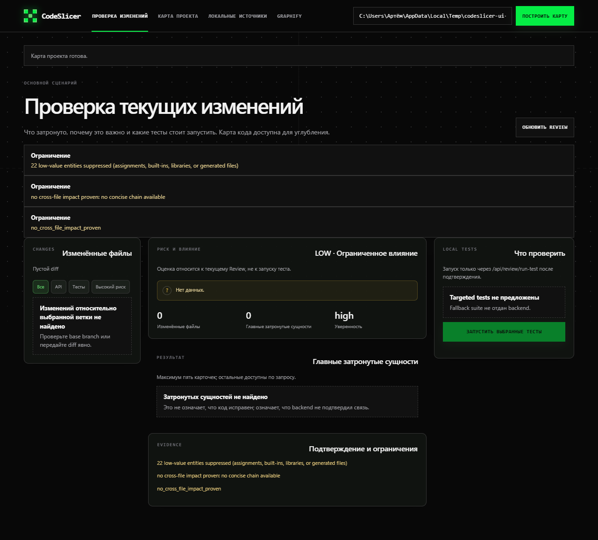
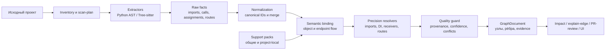
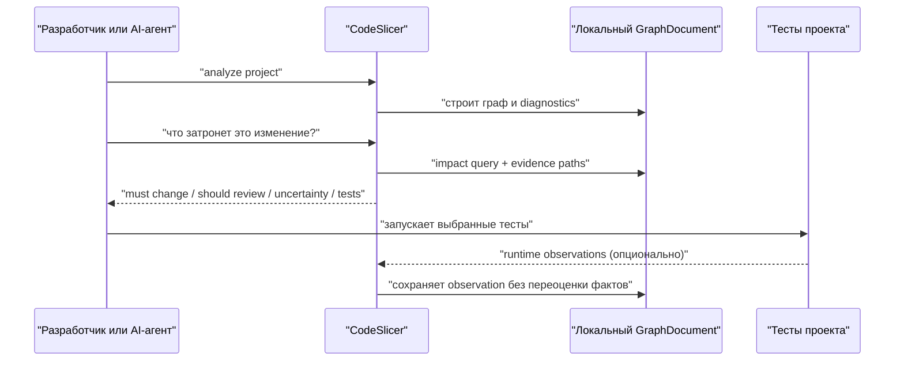

# CodeSlicer

<p align="center">
  <a href="https://github.com/artemnoor/CodeSlicer/actions/workflows/cli-installation.yml"></a>
  <a href="https://github.com/artemnoor/CodeSlicer/releases/tag/v0.5.0"></a>
  
  
  
  
  
  <a href="LICENSE"></a>
</p>

**CodeSlicer** — local-first рабочая система для понимания и безопасного
изменения кода. Это не только один анализатор: система объединяет независимые
движки, локальный UI, CLI и агентские интеграции, чтобы отвечать на разные
вопросы о проекте без смешения доказательств.

| Вопрос | Слой системы | Результат |
| --- | --- | --- |
| Что сломает эта правка и какие тесты запустить? | **CodeSlicer engine** | canonical evidence graph, impact, review, evidence chains и рекомендации тестов |
| Как в целом устроена архитектура, communities и документация? | **Graphify** — отдельный optional engine | собственный Graphify graph и его upstream viewer |
| Где объявлен символ или какая реализация вызывается? | optional **LSP / SCIP** | отдельная semantic navigation/evidence overlay |
| Как агенту применить всё это к задаче? | IDE skills, CLI и optional MCP | управляемый локальный workflow в выбранной IDE |

CodeSlicer engine строит доказуемый граф проекта, объясняет последствия правки
и подсказывает, что проверить: от функции и сервиса до route,
frontend-клиента и теста. Graphify отвечает за свой, изолированный
архитектурный граф. Local Hub показывает оба представления рядом, но не
подменяет один результат другим.

Внутреннее имя Python-пакета и команд — `impact_engine`.

## Проверка изменений перед merge

Для обычной проверки нужен один локальный путь: **установите extension → откройте проект → проверьте изменения → изучите риск, влияние, доказательства и тесты**. Команда для новых установок — `codeslicer`; `impact-engine` остаётся compatibility alias.

`codeslicer review <project> --json` выдаёт `ReviewReport/v2`: понятную сводку, источник проверки, freshness, ограниченный список затронутых областей, evidence, human-readable ограничения и безопасный test plan с `argv`, `cwd`, runner и confidence. Поля v1 сохранены для существующих клиентов.

VS Code extension находится в [`extensions/vscode`](extensions/vscode/README.md) как отдельный TypeScript package этого репозитория. Для обычного пользователя он поставляет platform-specific VSIX со встроенным self-contained CodeSlicer runtime: Python, pip, `.venv`, clone репозитория и ручной путь к executable не требуются. Runtime запускается отдельным локальным процессом только по явному действию в trusted workspace.

Помимо проверки текущих изменений extension поддерживает explicit local compare с base branch и выбор локального diff-file из Command Palette, а последние десять summary сохраняет только в workspace state. GitHub PR review запускается только отдельной командой через VS Code OAuth: extension читает metadata и diff выбранного PR, сохраняет diff в global storage и анализирует его локально. Исходный код не отправляется, checks/comments не публикуются.

GitHub PR review не требует и не хранит PAT: он использует VS Code Authentication/OAuth только после явного действия. Публикация checks или comments не реализована и в будущем потребует отдельного подтверждения. Graphify остаётся отдельным optional architecture engine и не смешивается с canonical CodeSlicer evidence/risk.

> Сайт сломался, а причина потерялась между frontend, API, сервисами, базой и
> десятками AI-правок? CodeSlicer строит единый граф проекта, чтобы точно
> увидеть цепочку поломки, её последствия и нужные точки проверки.

Граф помогает безопасно рефакторить, проверять PR, выбирать тесты и разбирать
незнакомые codebase без догадок по совпадающим именам.


## VS Code: встроенный runtime

Установите VSIX, соответствующий host extension (локальный Windows/macOS/Linux либо Linux в WSL/SSH/container/Codespaces), откройте проект и нажмите **«Проверить изменения»**. VSIX не скачивает source archive, не запускает `pip`, не создаёт `.venv` и не устанавливает Graphify. Проверяется manifest runtime с версией, target и SHA-256 launcher. Все шесть target (`win32-x64`, `win32-arm64`, `darwin-x64`, `darwin-arm64`, `linux-x64`, `linux-arm64`) готовятся отдельной native CI matrix; подробнее — [`extensions/vscode/README.md`](extensions/vscode/README.md).

Interactive demo в extension — только симуляция вкладок: он не меняет workspace, не скачивает ничего и не запускает CLI, Git или тесты.

## Начните здесь: Python Core из исходников

Для работы с Python Core из исходников достаточно Git и Python 3.10+. Все команды ниже создают
изолированную `.venv`: глобальные Python-пакеты и старый `impact-engine` в
`PATH` не используются. Рекомендуемая команда после установки —
`codeslicer`.

```powershell
# 1. Скачать CodeSlicer
git clone https://github.com/artemnoor/CodeSlicer.git
cd CodeSlicer

# 2. Создать изолированное .venv, установить CodeSlicer и открыть меню IDE
powershell -ExecutionPolicy Bypass -File .\scripts\install-windows.ps1
```

В меню: `↑`/`↓` — перемещение, `Space` — отметить IDE, `Enter` — установить.
Installer по умолчанию настраивает `user` scope: skills доступны во всех
последующих проектах. Перезапустите IDE и откройте свой рабочий репозиторий.

### macOS и Linux (bash/zsh)

```bash
# 1. Скачать CodeSlicer
git clone https://github.com/artemnoor/CodeSlicer.git
cd CodeSlicer

# 2. Создать изолированную среду и установить систему локально
python3 -m venv .venv
./.venv/bin/python -m pip install --upgrade pip
./.venv/bin/python -m pip install -e .

# 3. Открыть то же интерактивное меню IDE
./.venv/bin/codeslicer agent install
```

В меню: `↑`/`↓` — перемещение, `Space` — отметить IDE, `Enter` — установить.
Если `python3 -m venv` сообщает об отсутствующем модуле `venv`, установите
стандартный пакет Python venv вашей ОС и повторите команду. Не нужен `sudo pip`
и не нужно активировать окружение: команды выше всегда обращаются к `.venv`
напрямую.

### Что делать в новом репозитории

Агент уже может работать: skills дают ему workflow, а при доступе к терминалу
он запускает CodeSlicer через CLI. MCP — дополнительное удобство для прямых
структурированных вызовов из IDE, но не обязательное требование.

Чтобы самостоятельно построить canonical-граф конкретного проекта, выполните
из его папки (укажите путь к клону CodeSlicer один раз):

```powershell
$codeslicer = 'C:\work\CodeSlicer\.venv\Scripts\codeslicer.exe'
& $codeslicer onboard .
& $codeslicer review .
```

macOS/Linux:

```bash
CODESLICER="/absolute/path/to/CodeSlicer/.venv/bin/codeslicer"
"$CODESLICER" onboard .
"$CODESLICER" review .
```

Для Codex после установки достаточно перезапустить IDE. Для Kodik skills
работают сразу; его MCP подключается отдельно только если нужен, после создания
MCP-настройки в Kodik UI: `& $codeslicer agent repair`.

### Как система выбирает CodeSlicer, Graphify и агентские инструменты

| Что | Ставится при первом запуске | Для чего | Где результат |
| --- | --- | --- | --- |
| CodeSlicer engine | Да | impact, review, inspect, тесты | `.impact_engine/graph.json` |
| Skills для IDE | Да, для выбранных IDE | чтобы агент знал workflow | настройки выбранной IDE |
| MCP | Да, где клиент поддерживает конфигурацию | прямые tool-вызовы из IDE | локальная конфигурация IDE |
| Graphify engine | Нет | широкий обзор архитектуры и communities | `.codeslicer/artifacts/graphify/graphify-out/graph.json` |

Установка CodeSlicer **не клонирует и не скачивает репозиторий Graphify**.
Skills с названием Graphify — это только инструкция для агента, а не установка
внешнего инструмента. Агент использует CodeSlicer для evidence/impact-задач, а
Graphify — только для архитектурного вопроса и только когда отдельный локальный
Graphify runtime уже настроен и его graph существует. Graphify подключается
позже, для конкретного проекта и явным действием:

```powershell
# Проверить, доступен ли локальный Graphify: без сети и без запуска
& $codeslicer adapters native . graphify profile --json

# Если он настроен — явно построить отдельную архитектурную карту
& $codeslicer adapters native . graphify index --confirm
```

Graphify не заменяет CodeSlicer и CodeSlicer не «встраивает» Graphify: это два
движка с разными graph и запросами. Graphify помогает найти communities и
связи архитектуры, а CodeSlicer доказывает конкретный impact и выбирает тесты.
На время запуска Graphify CodeSlicer автоматически исключает `.venv`, `venv`,
`env`, `node_modules` и свои служебные каталоги; исходный `.graphifyignore`,
если он был, восстанавливается без изменений.

### Ручной вариант для разработки

```powershell
py -3 -m venv .venv
.venv\Scripts\Activate.ps1
python -m pip install --upgrade pip
python -m pip install -e .

# Команда из активированного окружения; она не конфликтует со старыми Python-установками
codeslicer agent install

# Построить граф проекта и открыть локальный UI
codeslicer onboard C:\work\my-project
impact-engine-local-api --default-project C:\work\my-project
```

Откройте <http://127.0.0.1:8001/>. Для Linux/macOS замените активацию окружения
на `source .venv/bin/activate`.

## AI-интеграции и skills

Пакет содержит безопасный installer для IDE и coding agents. Он читает два
skills из wheel через `importlib.resources`, копирует их отдельно и
регистрирует только локальный MCP-сервер `codeslicer`:

- `codeslicer-impact-analysis` — impact analysis, PR review, рефакторинг и тесты;
- `graphify-architecture-analysis` — архитектурный обзор и communities.

Installer не создаёт и не изменяет `code-intelligence-orchestrator`,
`project-onboarding-workflow`, `AGENTS.md` или исходный код проекта.

```powershell
# Показать обнаруженные локальные AI-клиенты
codeslicer agent detect

# Самый простой путь: стрелки — навигация, Space — выбор IDE, Enter — установка
# Интерактивная установка использует user scope, то есть работает во всех проектах.
codeslicer agent install

# Явный выбор и безопасный preview остаются доступны
codeslicer agent install --client codex --scope project
codeslicer agent install --client kodik --scope project --dry-run --json

# Проверить реальные bundled assets и stdio MCP handshake
codeslicer agent doctor
codeslicer agent status
codeslicer agent uninstall
```

`codeslicer` — рекомендуемая команда для новых установок: она не конфликтует
со старым `impact-engine.exe` из другого Python. `project` scope пишет в проект;
`user` — в домашний каталог клиента. Cursor
получает отдельные `.mdc` rules, Kiro — steering-файлы, а native clients —
отдельные `SKILL.md`. После установки перезапустите IDE. Полная матрица путей
и ограничений: [совместимость AI-клиентов](docs/AGENT_CLIENT_COMPATIBILITY.md).

В интерактивном терминале команда без параметров покажет обнаруженные IDE. Если
ни одна не найдена, она предложит полный поддерживаемый каталог. В JSON и CI
режимах вопросы не задаются: используйте `--client <id>` или
`--client all-detected --yes`.

## Локальный UI и MCP

Веб-интерфейс работает только на localhost и отображает настоящий
`GraphDocument`. Graphify — отдельная, optional-карта: без явного index её нет,
и UI не подставляет вместо неё данные CodeSlicer.



MCP-сервер запускается без shell-wrapper:

```bash
impact-engine-mcp
# или
python -m impact_engine.mcp.server
```

`impact-engine agent doctor` делает фактический JSON-RPC `initialize` и
`tools/list`, проверяя `scan_plan`, `project_status`, `review` и `inspect`.

Подробно о Graphify, SCIP/LSP, contracts, runtime и security sources без
смешения их evidence: [документ по интеграциям](docs/INTEGRATIONS.md).

## Содержание

- [Возможности](#возможности)
- [Система целиком](docs/PRODUCT_GUIDE.md)
- [Первый запуск на Windows, macOS и Linux](docs/GETTING_STARTED.md)
- [Как строятся связи](#как-строятся-связи)
- [Как агент работает с графом](#как-агент-работает-с-графом)
- [Быстрый старт](#быстрый-старт)
- [AI-интеграции и skills](#ai-интеграции-и-skills)
- [Локальный UI и MCP](#локальный-ui-и-mcp)
- [Анализ проекта](#анализ-проекта)
- [Визуальный интерфейс](#визуальный-интерфейс)
- [Интеграции и отдельные графы](docs/INTEGRATIONS.md)
- [Что изменено в этом релизе](#что-изменено-в-этом-релизе)
- [MCP](#mcp)
- [Неизвестные библиотеки](#неизвестные-библиотеки)
- [Персонализация для проекта](#персонализация-для-проекта)
- [PR-review](#pr-review)
- [Формат графа](#формат-графа)
- [Поддержка языков](#поддержка-языков)
- [Структура репозитория](#структура-репозитория)
- [Ограничения](#ограничения)
- [Разработка](#разработка)

## Как это работает


```mermaid
flowchart LR
  Project["Исходный проект"] --> Inventory["Inventory и scan-plan"]
  Inventory --> Extract["Extractors\nPython AST / Tree-sitter"]
  Extract --> Facts["Raw facts\nimports, calls, assignments, routes"]
  Facts --> Normalize["Normalization\ncanonical IDs и merge"]
  Normalize --> Bind["Semantic binding\nobject и endpoint flow"]
  Packs["Support packs\nобщие и project-local"] --> Bind
  Bind --> Resolve["Precision resolvers\nimports, DI, receivers, routes"]
  Resolve --> Guard["Quality guard\nprovenance, confidence, conflicts"]
  Guard --> Graph["GraphDocument\nузлы, рёбра, evidence"]
  Graph --> Queries["Impact / explain-edge / PR-review / UI"]
```

Экстракторы извлекают факты из исходного кода. Резолверы создают семантические
рёбра только при наличии цепочки доказательств. Неоднозначные и неподдержанные
случаи остаются в диагностике, а не превращаются в подтверждённые связи по
одному совпадению имени.

### Что хранится локально

```text
<project>/.impact_engine/
  graph.json                 итоговый GraphDocument
  facts.json                 кэш извлечённых фактов
  impact_registry.sqlite     локальный registry и история
  scan_plan.json             область анализа
  local_packs/               персональные правила конкретного проекта
  unknown_region_tasks.json  задачи на исследование пробелов
```

Исходный код и граф остаются на машине пользователя. Для базового анализа не
нужны облачная база, Supabase или внешний API.

## Как строятся связи

CodeSlicer не считает одинаковые имена доказательством связи. Для каждого
рёбра он стремится собрать воспроизводимую цепочку фактов.

```text
self.repository.save(order)
  -> assignment: self.repository = repository
  -> constructor parameter: repository: OrderRepository
  -> declaration: OrderRepository.save
  -> resolved CALLS edge с evidence и confidence
```

Типичные источники доказательств:

- import и alias resolution;
- assignment, field и parameter propagation;
- constructor и provider/DI bindings;
- return type и factory propagation;
- receiver identity и method lookup;
- HTTP method + canonical path для frontend/backend bridge;
- versioned support-pack rule с provenance.

Если доказательств недостаточно, результат помечается как `ambiguous`,
`unresolved`, `unsupported` или `suspicious`. Такая область может стать
задачей для AI research workflow, но AI не добавляет confirmed edge напрямую.

## Как агент работает с графом


```mermaid
sequenceDiagram
  participant Dev as "Разработчик или AI-агент"
  participant Engine as "CodeSlicer"
  participant Graph as "Локальный GraphDocument"
  participant Tests as "Тесты проекта"

  Dev->>Engine: "analyze project"
  Engine->>Graph: "строит граф и diagnostics"
  Dev->>Engine: "что затронет это изменение?"
  Engine->>Graph: "impact query + evidence paths"
  Engine-->>Dev: "must change / should review / uncertainty / tests"
  Dev->>Tests: "запускает выбранные тесты"
  Tests-->>Engine: "runtime observations (опционально)"
  Engine->>Graph: "сохраняет observation без переоценки фактов"
```

Агенту не нужно передавать весь репозиторий в контекст для каждого вопроса.
Он может запросить графовый срез: изменённый узел, кратчайшие evidence paths,
затронутые routes, сервисы и тесты. Это уменьшает лишний контекст и делает
его решения проверяемыми.

## Возможности

- инвентаризация проекта и детерминированный план области анализа;
- Python AST-анализ с наиболее полным semantic resolution;
- structural и limited semantic extraction для JavaScript, TypeScript, Go и
  Java через Tree-sitter, с optional framework packs для популярных web/API
  фреймворков и их поддерживаемых версий;
- разрешение импортов, constructor/field/provider binding и nested object chains;
- frontend → backend endpoint bridge по service, HTTP method и canonical path;
- versioned support packs с provenance, trust level и confidence caps;
- impact queries, объяснение рёбер и PR-review;
- выбор связанных тестов;
- дополнительная runtime-проверка Python-связей;
- локальный SQLite registry и JSON cache;
- CLI, MCP-сервер, интерактивная локальная карта и оригинальный Graphify viewer.

## VS Code Impact Cockpit

В репозитории есть самостоятельный TypeScript package
[`extensions/vscode/`](extensions/vscode/): local-first панель для VS Code.
Она не содержит второго анализатора: в platform-specific VSIX лежит
самодостаточный Python CodeSlicer runtime, который extension запускает как
отдельный локальный процесс. Для обычного пользователя не нужны системный
Python, `pip`, `.venv`, clone репозитория или путь к executable.

### Что видит разработчик

1. **«Проверка»** — working tree, staged changes, compare branch, diff-file или optional GitHub PR.
2. **«Результат»** — риск, причины, затронутые сущности и кликабельные evidence.
3. **«Тесты»** — рекомендации и отдельное подтверждение каждого запуска.
4. **«Технологии»** — встроенное coverage, freshness и честный статус optional packs.
5. **«История»** — последние local-only summaries.
6. **«Архитектура»** — ограниченный canonical CodeSlicer slice; Graphify остаётся отдельным optional engine.
7. **«Настройки»** — только advanced/developer options.

При первом открытии пустая папка предлагает открыть/создать проект или импортировать Git-репозиторий. В готовом проекте есть безопасный интерактивный гид: он переключает реальные вкладки и не запускает CLI, Git, тесты или сеть.

Local review сравнивает **локальный Git diff** с verified base branch. Для выбранного GitHub PR extension после OAuth читает только metadata и diff, сохраняет diff локально и не публикует checks/comments. Он не отправляет исходный код наружу и не запускает CLI при activation. Все запуски происходят только после явного нажатия пользователя; в недоверенном workspace CLI не запускается. Команда, рабочая папка, stdout, stderr и ошибки доступны в Output Channel `CodeSlicer`.

### Встроенный runtime и platform packages

Устанавливайте VSIX, соответствующий extension host: `win32-x64`,
`win32-arm64`, `darwin-x64`, `darwin-arm64`, `linux-x64` или `linux-arm64`.
Runtime находится в VSIX, проверяет platform/architecture и SHA-256 каждого
заявленного файла перед запуском. Если target не подходит, extension не
скачивает substitute и показывает диагностику.

Дополнительные language packs требуют отдельного подписанного registry. Пока
registry не настроен, никаких обращений в сеть нет, а встроенный Core работает
офлайн. Graphify не скачивается и не устанавливается extension: можно
подключить только уже установленный локальный Graphify.

Graphify остаётся независимым optional engine. Его architecture graph никогда
не смешивается с canonical CodeSlicer graph, risk или evidence. Расширение не
запускает и не скачивает Graphify в фоне.

В cockpit доступны русский и английский языки. Интерфейс не запускает анализ,
runtime, Graphify или тесты сам: для каждого процесса нужно отдельное действие.

GitHub не использует PAT и не сохраняет token в настройках или workspace.
Команда review PR получает ephemeral OAuth session из VS Code только после
явного действия пользователя, затем выполняет два read-only API GET-запроса.

### Установка extension и разработка

Расширение доступно в [Visual Studio Marketplace](https://marketplace.visualstudio.com/items?itemName=codeslicer.codeslicer-impact-cockpit).
В VS Code откройте Extensions, найдите **CodeSlicer**, установите его и затем
откройте иконку CodeSlicer в Activity Bar.

Для локальной разработки или сборки VSIX:

```powershell
cd extensions/vscode
npm ci
npm test
npm run package
```

Откройте `extensions/vscode` в VS Code и нажмите `F5`, чтобы запустить
Extension Development Host. Подробности, конфигурация и troubleshooting — в
[инструкции пакета](extensions/vscode/README.md).

## Быстрый старт

### Требования

- Python 3.10 или новее;
- Git;
- права записи в рабочую директорию;
- Node.js опционален и нужен только для browser verification или инструментов
  самого анализируемого frontend-проекта;
- Docker опционален.

### Windows PowerShell

```powershell
git clone https://github.com/artemnoor/CodeSlicer.git
cd CodeSlicer
py -3 -m venv .venv
.venv\Scripts\Activate.ps1
python -m pip install --upgrade pip
pip install -e .
```

Для проверки именно будущей установки соберите wheel и установите его в чистое
окружение. Wheel включает и web UI, и manifest-backed plugins:

```bash
python -m pip install build
python -m build --wheel
python -m pip install dist/impact_engine-0.5.0-py3-none-any.whl
```

### Linux или macOS

```bash
git clone https://github.com/artemnoor/CodeSlicer.git
cd CodeSlicer
python3 -m venv .venv
source .venv/bin/activate
python -m pip install --upgrade pip
pip install -e .

# Откройте интерактивный выбор IDE: стрелки, Space, Enter.
codeslicer agent install
```

Проверьте установку:

```bash
impact-engine doctor
impact-engine --json registry status
```

Registry должен работать в режиме `sqlite`.

### Подключить новый проект

Для локальной папки одна команда строит два отдельных графа: canonical
CodeSlicer graph для impact/review и optional Graphify graph для широкого
архитектурного обзора. Graphify никогда не меняет ranking CodeSlicer.

```bash
impact-engine --json onboard /path/to/project --graphify auto
```

Git URL требует явного разрешения на сеть; клон остаётся в локальном
workspace, а исходный код не отправляется в CodeSlicer:

```bash
impact-engine --json onboard https://github.com/AlekseyYudin-161/JunMate.git \
  --allow-network --graphify auto
```

После изменения кода сначала получите рекомендации, а запуск тестов выполняйте
только отдельным подтверждённым действием:

```bash
impact-engine --json review /path/to/project --run-tests suggested
impact-engine ci /path/to/project --run-tests --test-command pytest tests/test_example.py
```

### Подключить IDE или coding agent

Используйте installer из раздела [AI-интеграции и skills](#ai-интеграции-и-skills),
а не копируйте общий instruction prompt. Он сам создаёт отдельные managed
skill-файлы и одну MCP-запись. Для уже установленной интеграции доступны:

```bash
impact-engine agent status
impact-engine agent repair
impact-engine agent uninstall
```

Проверьте state локального UI после анализа через `/api/health`, `/api/state`
и `/api/graph`; граф по умолчанию находится в
`<project>/.impact_engine/graph.json`.

## Анализ проекта

### 1. Сначала проверьте область

Для большого проекта сначала создайте scan plan:

```bash
impact-engine scan-plan /path/to/project
```

План исключает `node_modules`, виртуальные окружения, `.git`, `.impact_engine`,
build/dist/coverage и вложенные Git-репозитории. Перед анализом большого
workspace просмотрите список включённых файлов.

### 2. Постройте граф

```bash
impact-engine analyze /path/to/project \
  --use-scan-plan
```

По умолчанию CLI сохраняет граф в
`<project>/.impact_engine/graph.json`; его автоматически подхватит локальный
визуальный интерфейс. `--out` нужен только для явного нестандартного пути.
Во время обычного запуска CLI
показывает прогресс по этапам. При `--json` структурированный результат
остаётся в stdout, а прогресс выводится в stderr.

### 3. Выполните запрос влияния

```bash
impact-engine impact /path/to/project/.impact_engine/graph.json \
  --symbol repositories.OrderRepository.save \
  --direction both
```

Доступны направления `upstream`, `downstream` и `both`. Для автоматической
обработки агентом добавляйте `--json` перед подкомандой.

### 4. Объясните связь

```bash
impact-engine explain-edge /path/to/project/.impact_engine/graph.json \
  --from services.OrderService.create_order \
  --to repositories.OrderRepository.save
```

Ответ содержит источник, confidence, evidence chain, resolver attribution и
support-pack rule, если они участвовали в создании связи.

## Визуальный интерфейс

Запустите локальный API:

```bash
impact-engine-local-api \
  --host 127.0.0.1 \
  --port 8001 \
  --default-project /path/to/project
```

Откройте <http://127.0.0.1:8001/>.

CLI и API — отдельные процессы. API автоматически загружает
`<project>/.impact_engine/graph.json`. Если граф пустой, проверьте:

```text
GET /api/health  -> status: ok
GET /api/state   -> has_analysis: true
GET /api/graph   -> непустые nodes и edges
```

Для графа в другом месте используйте `POST /api/load-graph`:

```json
{
  "project_path": "/path/to/project",
  "graph_path": "/path/to/graph.json"
}
```

Интерфейс работает с реальным локальным GraphDocument. Mock-графа, Supabase и
другой hosted database в UI нет. Он не дублирует CLI/MCP-настройки: сложные
режимы остаются в CLI и agent skills, а UI отвечает за быстрый визуальный
контроль проекта.

### Карта CodeSlicer

Маршрут `#map` показывает граф CodeSlicer. Точки — сущности проекта, линии —
связи с evidence. По умолчанию селектор **«Обзор связей»** оставляет карту
быстрой. Выберите **«Показать все связи»**, чтобы отрисовать полный canonical
graph без лимита проекции; для очень большого проекта это может занять время
и линии станут плотными. Карту можно перетаскивать, масштабировать колесом или
кнопками, а выбор узла открывает его тип, ближайшие связи, источник и
доказательство. Это удобная отправная точка для понимания незнакомого кода и
последствий изменения.


### Отдельная карта Graphify

Маршрут `#graphify` не перерисовывает данные Graphify собственным SVG-кодом.
При наличии `<project>/.codeslicer/artifacts/graphify/graphify-out/graph.json`
CodeSlicer локально запускает
оригинальный HTML renderer Graphify в отдельном iframe: поиск по узлам,
комьюнити и поведение графа остаются возможностями самого Graphify. Этот
граф помогает исследовать общую архитектуру; canonical graph и ranking
CodeSlicer от него не изменяются.


Если Graphify ещё не строился, UI честно показывает, что отдельная карта не
подключена, и не подставляет вместо неё граф CodeSlicer. Создайте её явно:

```bash
impact-engine --json onboard /path/to/project --graphify auto
```

## Что изменено в этом релизе

Полный список изменений: [v0.5.0](https://github.com/artemnoor/CodeSlicer/releases/tag/v0.5.0).

- минимальный local-first UI сфокусирован на двух задачах: понять карту
  CodeSlicer и открыть независимую карту Graphify;
- у карты появились панорамирование, zoom, клавиатурное управление и
  инспектор evidence для выбранного узла;
- Graphify отображается своим upstream HTML renderer, а не адаптированной
  SVG-картой CodeSlicer;
- полный анализ получил более честный прогресс и кооперативную отмену между
  файлами, а default scan исключает generated/tool-runtime директории;
- wheel теперь включает frontend и manifest-backed language/framework plugins;
- GitHub Actions собирает wheel и проверяет его в чистой venv: UI, API и
  discovery Python/TypeScript/C# plugins.
- Добавлен `impact-engine agent`: discovery, безопасная установка двух skills,
  status, real MCP doctor, repair и ownership-aware uninstall для 16 AI-клиентов.
- Kodik IDE получил native skill adapter и JSONC MCP patcher с ключом `servers`;
  чужие серверы и комментарии сохраняются.

### Release hardening 0.5.0

- Версия пакета повышена до `0.5.0`; wheel и MCP server-info используют одну
  версию.
- Browser E2E — обязательный отдельный job на каждом push и pull request:
  он устанавливает Playwright и Chromium, поэтому тест не может «молча» стать
  skipped.
- Реальный C# review на публичном Cruxa вынесен из обычной регрессии в
  еженедельный/manual acceptance workflow. Он фиксирует commit корпуса,
  создаёт read-only diff и не требует хранить чужой проект в этом репозитории.
- Fast persistent-cache теперь загружает `facts.json`, поэтому `facts_reused`
  отражает реально переиспользованные факты. `.sln` и `.slnx` учитываются как
  manifest-файлы.
- Clean-wheel проверка подтверждает, что agent installer читает skills из
  установленного пакета и запускает MCP из того же virtualenv.

Подробное описание изменения, границы и E2E-матрица: [docs/PR_DESCRIPTION.md](docs/PR_DESCRIPTION.md).

## MCP

CodeSlicer предоставляет локальный JSON-RPC MCP-сервер через stdio:

```bash
impact-engine-mcp
```

или:

```bash
python -m impact_engine.mcp.server
```

Пример конфигурации редактора или AI-агента:

```json
{
  "mcpServers": {
    "codeslicer": {
      "command": "impact-engine-mcp",
      "args": []
    }
  }
}
```

Используйте `tools/list` как источник актуальных MCP-схем. Сервер предоставляет
инструменты для inventory, анализа, impact queries, explain-edge, PR-review,
runtime validation, support packs, research workflow и локального registry.

Подробнее: [docs/MCP.md](docs/MCP.md).

## Неизвестные библиотеки

Если библиотека не покрыта доверенным support pack, система не угадывает её
семантику по имени. Она создаёт research request:

```text
unknown library
  -> research request
  -> официальные docs и repository
  -> candidate support pack
  -> schema/provenance/fixture/mutation validation
  -> trust promotion
  -> повторный анализ
```

Запуск workflow:

```bash
impact-engine libraries research /path/to/project \
  --library unknown_library \
  --ecosystem python \
  --build-input
```

Внешний AI-агент или человек создаёт candidate pack. Детерминированное ядро
проверяет его и не позволяет AI напрямую записывать подтверждённые рёбра.

Полный регламент: [docs/SUPPORT_PACKS.md](docs/SUPPORT_PACKS.md).

## Персонализация для проекта

У проекта могут быть private SDK, внутренние HTTP-wrapper-ы и собственные
DI-паттерны, которых нет в общем CodeSlicer registry. Для этого есть
**project-local support packs**. Они сохраняются только рядом с проектом:

```text
<project>/.impact_engine/local_packs/<language>/<library>/support_pack.json
```

Локальный pack загружается раньше общего pack с тем же языком и библиотекой,
но не меняет GitHub-репозиторий CodeSlicer, глобальный `support_packs/` и
SQLite registry.

```bash
impact-engine project-packs init /path/to/project
impact-engine project-packs install /path/to/project candidate_pack.json \
  --trust-level experimental
impact-engine project-packs list /path/to/project
impact-engine analyze /path/to/project --out /path/to/project/.impact_engine/graph.json
```

Требования безопасности остаются прежними: schema validation, source
provenance и `forbid_name_only=true` обязательны. Pack уровня `draft` или
`staged` сохраняется, но не участвует в обычном анализе. Локальный pack не
может получить глобальный уровень `trusted`: универсальное правило должно
перейти в общий registry через отдельный review и benchmark workflow.

Локальные packs поддерживают декларативные правила. Если проекту нужен новый
исполняемый resolver, AI должен подготовить отдельный proposal, fixture и
тесты для PR в CodeSlicer, а не произвольно переписывать ядро анализатора.

## PR-review

`--diff-file` указывает изменение для проверки, но не ограничивает область
первичного парсинга. Если не передать `--graph`, CodeSlicer может заново
анализировать весь большой проект.

Сначала создайте или обновите граф:

```powershell
impact-engine analyze C:\path\to\project `
  --use-scan-plan `
  --out C:\path\to\project\.impact_engine\graph.json
```

Затем переиспользуйте его:

```powershell
impact-engine pr-review C:\path\to\project `
  --diff-file C:\path\to\change.diff `
  --graph C:\path\to\project\.impact_engine\graph.json
```

Отчёт содержит изменённые файлы и символы, risk score, confirmed/likely/
suspicious impact, unresolved boundaries и рекомендуемые тесты.

## Четыре режима CodeSlicer

CLI, local API и MCP используют единый локальный контракт:

```text
review → inspect → investigate → ci
```

```powershell
impact-engine review . --max-results 10 --json
impact-engine inspect . --entity "Cruxa.Api.Features.Routes.RoutesController.Create" --json
impact-engine investigate . --entity "route:httpget:api/orders" --direction downstream --depth 8 --json
impact-engine ci . --base origin/main --format json --out .impact_engine/ci-report.json
```

`review` сохраняет `ReviewReport/v1`; остальные mode-ответы используют
`CodeSlicerModeReport/v1`, а общий `contract_version` —
`CodeSlicerModeContract/v1`. CI по умолчанию advisory и завершает процесс с
кодом 0; policy violation — 1, invalid input/config — 2, невозможность
анализа — 3. Тесты и runtime validation запускаются только по явному флагу.
Исходный код, graph, diff и telemetry не отправляются наружу. IDE, PR,
GitHub/GitLab и release delivery будут тонкими клиентами поверх этого
контракта на следующем этапе.

## Формат графа

Анализ создаёт JSON-артефакт `GraphDocument`:

- `nodes` — файлы, модули, классы, функции, методы, routes, tests и внешние
  библиотеки;
- `edges` — imports, calls, bindings, route handling, HTTP calls, endpoint
  matches и другие типизированные связи;
- `metadata` — языки, diagnostics, coverage, unknown regions, fingerprints,
  resolver data и support-pack provenance.

Узлы имеют stable canonical identity и source location. Рёбра могут содержать
confidence, evidence, `source_fact_ids`, `dependency_keys`, `resolver_id` и
статус разрешения.

## Поддержка языков

| Язык | Статус |
| --- | --- |
| Python | strongest semantic baseline |
| JavaScript / TypeScript | local import/re-export и direct-call resolution; endpoint bridge; Express, React, NestJS 8–11 и Fastify 4–5 packs |
| Go | typed receiver/struct-field calls; literal Gin, Chi v5, Echo v4 и Fiber v2–3 routes |
| Java | typed receiver/constructor injection; literal Spring, JAX-RS 2–3 и Micronaut 3–4 routes |
| C# | typed member/DI calls; ASP.NET routes, explicit DI, MediatR, EF Core и Refit 6–7 packs |

Каждое confirmed static edge требует явной локальной синтаксической причины:
declaration/import, typed receiver, literal route или явную DI-регистрацию.
Dynamic import, reflection, generated code, proxy/interface dispatch с
несколькими implementation и compiler-only overload/type facts остаются
`limited`/`unresolved`; для них нужен явный LSP или SCIP overlay. Для
JavaScript, TypeScript, Go и Java возможен fallback, если native Tree-sitter
недоступен. Framework pack создаёт route/client edge только если в исходнике
есть literal declaration и уже извлеченный локальный обработчик. Например,
анонимный callback, переменная с динамическим маршрутом или prefix, собранный
во время выполнения, честно не превращается в «подтверждённую» связь.
Для Chi пока так же пропускаются parameterized nested routes (`Route("/{id}",
...)`): текущая canonical route identity объединяет их со статическим базовым
маршрутом, поэтому выдавать связь как точную было бы неверно.

## Структура репозитория

```text
src/impact_engine/        ядро, CLI, MCP и local API
support_packs/             правила фреймворков и библиотек
frontend/                  локальный graph viewer
tests/                     unit, fixture, CLI, MCP и regression tests
examples/                  небольшие воспроизводимые проекты
docs/                      подробная документация
integrations/agent-skills  инструкции для AI-агентов
```

## Ограничения

CodeSlicer — статический анализатор, а не компилятор и не универсальный
runtime debugger. На качество влияют:

- reflection и динамический dispatch;
- runtime-selected dependency injection;
- сложные generics и generated proxies;
- динамическая сборка routes и URL;
- private dependencies без support pack;
- отсутствие достаточных типов и evidence.

Такие случаи классифицируются как `ambiguous`, `unresolved`, `unsupported`
или `suspicious`, а не объявляются подтверждёнными без доказательств.

Текущая scoring-модель — интерпретируемая эвристика, а не научно
калиброванная вероятность. Коэффициенты можно калибровать по размеченным
изменениям, результатам тестов и пользовательской обратной связи.

Подробнее: [docs/LIMITATIONS.md](docs/LIMITATIONS.md).

## Разработка

```bash
python -m pytest -q
impact-engine doctor
impact-engine --json registry status
```

Для browser E2E локально:

```bash
python -m pip install ".[dev,browser]"
python -m playwright install chromium
IMPACT_ENGINE_REQUIRE_BROWSER_E2E=1 python -m pytest tests/test_frontend_browser_e2e.py -q
```

Основной CI запускает browser E2E на каждом push/PR. Внешний C# acceptance
на pinned [Cruxa](https://github.com/contr4s/Cruxa) запускается отдельно по
расписанию или вручную, чтобы тяжёлый внешний corpus не становился скрытым
skipped-тестом обычной регрессии.

Графы, кэши, SQLite и benchmark-отчёты должны оставаться в `.impact_engine`
или других игнорируемых директориях, а не попадать в продуктовую документацию.

## Лицензия

Проект распространяется по лицензии [MIT](LICENSE).

## Localhost Visual Intelligence Hub

Локальный Hub даёт четыре изолированных режима: Review, Inspect,
Investigate и Architecture. Review остаётся bounded и объясняет risk через
evidence chains; Investigate запускает только явные ограниченные запросы;
Architecture показывает canonical CodeSlicer graph и supplemental overlays
Graphify, CodeGraph, SCIP, LSP, OTel, Boundary и Security/SBOM.

Главный экран показывает freshness, coverage, cache/daemon health и
исключённые generated/vendor/dependency paths, не выдавая размер графа за его
качество. Progressive graph lens сначала показывает modules/files, а symbols
и edges раскрывает только после explicit bounded action. Внешние overlays не
меняют canonical graph, Review risk, ranking или test recommendations.

Hub работает local-first: API same-origin localhost, `network_used=false`,
артефакты импортируются только по absolute local path, без upload, telemetry,
скачиваний и скрытого запуска инструментов.

## Опциональные адаптеры

Все 11 интеграций доступны, но изначально выключены: Graphify, CodeGraph,
SCIP, LSP, OpenAPI, AsyncAPI, OpenTelemetry, CycloneDX, SPDX, SARIF и
Joern/CPG. Они добавляют только отдельный evidence overlay для Architecture
или Investigate: canonical CodeSlicer graph, risk, review ranking и подбор
тестов от них не меняются.

Перед подключением покажите единый локальный план действий:

```bash
impact-engine --json adapters preflight /path/to/project
```

Для адаптера с готовым локальным артефактом импорт и включение — одно
явное действие. Артефакт копируется в `<project>/.codeslicer/artifacts/`,
проверяется fingerprint и не отправляется наружу:

```bash
impact-engine --json adapters import /path/to/project graphify \
  /absolute/path/to/graphify-out/graph.json --enable

impact-engine --json adapters import /path/to/project cyclonedx \
  /absolute/path/to/bom.json --enable
```

LSP — единственное исключение: это явно выбранный локальный процесс, а не
файл. Его надо настроить с абсолютным путём к уже установленному серверу:

```bash
impact-engine --json adapters lsp configure /path/to/project \
  --executable /absolute/path/to/language-server \
  --workspace-root /path/to/project \
  --backend agent_lsp \
  --compile-commands /path/to/project/build/compile_commands.json
```

Для C/C++ сначала выполните read-only preflight: он показывает обнаруженный
build context и качество `compile_commands.json`, но не конфигурирует и не
запускает сервер. Затем явно проверьте возможности выбранного runtime:

```bash
impact-engine --json adapters lsp preflight /path/to/project
impact-engine --json adapters lsp probe /path/to/project
```

`agent_lsp` — optional thin integration с официальным `agent-lsp` по MCP stdio.
Agent-LSP владеет warm sessions, skills, hierarchy и semantic navigation;
CodeSlicer хранит только отдельный provenance-bearing overlay и применяет
собственную build-context/mapping policy. `native_stdio` остаётся короткоживущим
fallback. Agent-LSP никогда не скачивается автоматически.

Joern также не устанавливается и не запускается автоматически: он принимает
только уже созданный пользователем локальный interchange-экспорт. Проверить
состояние любого подключения можно через
`impact-engine --json adapters status /path/to/project <adapter-id>`.

## Дополнительная документация

- [Getting Started](docs/GETTING_STARTED.md)
- [Architecture](docs/ARCHITECTURE.md)
- [MCP](docs/MCP.md)
- [Support Packs](docs/SUPPORT_PACKS.md)
- [Limitations](docs/LIMITATIONS.md)
- [Joern / CPG adapter](docs/adapters-joern.md)
